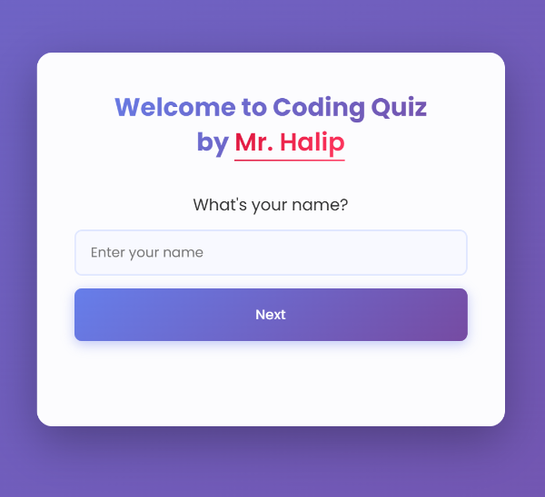

# Coding Quiz - Interactive Web Development & Python Quiz

Welcome to **Coding Quiz**, an interactive and dynamic quiz platform created by [Mr. Halip](https://halip26.github.io/). Test your programming knowledge with personalized quizzes in Web Development and Python!

## Preview Screenshot



## ✨ Features

### 🎯 Dynamic Quiz System

- **Personalized Experience**: Enter your name and age before starting
- **Two Quiz Categories**:
  - Basic Web Development (HTML, CSS, JavaScript)
  - Basic Python Programming
- **15 Questions Per Category**: Comprehensive coverage of fundamental concepts
- **Randomized Questions**: Questions appear in random order for each session
- **Real-time Scoring**: Instant feedback on your performance

### 🎨 Modern UI/UX

- **Animated Transitions**: Smooth, professional animations between screens
- **Gradient Design**: Modern purple-pink gradient theme
- **Fully Responsive**: Works perfectly on desktop, tablet, and mobile devices
- **User-Friendly Interface**: Clean and intuitive design

### 📊 Smart Results

- **Personalized Feedback**: Results include your name and age
- **Performance-Based Messages**: Different encouragement based on your score
  - 80%+ : "Excellent work!"
  - 60-79%: "Good job!"
  - <60%: "Keep learning!"
- **Restart Option**: Easy replay with "Play Again" button

### 🗂️ Clean Architecture

- **Separation of Concerns**: Quiz data stored in JSON file
- **Modular Design**: Easy to add more quiz categories
- **Maintainable Code**: Well-organized and commented

## 🚀 How to Use

1. **Clone the repository**

   ```bash
   git clone https://github.com/halip26/coding-quiz.git
   cd coding-quiz
   ```

2. **Open the quiz**
   - Simply open `index.html` in your web browser
   - Or use a local server for better experience

3. **Take the quiz**
   - Enter your name
   - Enter your age
   - Choose between Web Development or Python quiz
   - Answer all 15 questions
   - View your results with personalized feedback

## 📁 Project Structure

```
quiz-game-js/
├── assets/
│   ├── css/
│   │   └── style.css          # Modern styling with gradients
│   ├── data/
│   │   └── quizData.json      # Quiz questions (Web Dev & Python)
│   ├── images/
│   │   ├── quiz-game.png      # Favicon
│   │   └── screenshot.png     # Preview image
│   └── js/
│       └── script.js          # Quiz logic and interactivity
├── index.html                 # Main HTML file
├── README.md                  # This file
└── LICENSE                    # MIT License
```

## 🛠️ Technologies Used

- **HTML5**: Semantic markup structure
- **CSS3**:
  - Custom properties
  - Flexbox layout
  - CSS animations and transitions
  - Gradient backgrounds
  - Responsive design with media queries
- **JavaScript (ES6+)**:
  - Async/await for data loading
  - Fetch API for JSON data
  - DOM manipulation
  - Event handling
  - Array methods (shuffle algorithm)
- **JSON**: External data storage for quiz questions

## 🎨 Design Highlights

- **Font**: Poppins (Google Fonts)
- **Color Scheme**:
  - Primary: Purple to Pink gradient (#667eea → #764ba2 → #f093fb)
  - Success: Green gradient (#2ecc71 → #27ae60)
  - Backgrounds: Light gradient overlays
- **Animations**: Smooth fade-in/fade-out transitions
- **Shadows**: Layered shadows for depth

## 📱 Responsive Design

The quiz automatically adapts to:

- Desktop (600px+)
- Tablet (600px and below)
- Mobile devices (optimized touch targets)

## 🔧 Customization

### Adding More Questions

Edit `assets/data/quizData.json`:

```json
{
  "webDev": [
    {
      "question": "Your question here?",
      "a": "Option A",
      "b": "Option B",
      "c": "Option C",
      "d": "Option D",
      "correct": "a"
    }
  ]
}
```

### Adding New Quiz Categories

1. Add new category to `quizData.json`
2. Update `script.js` to handle the new category
3. Add button in HTML for the new quiz type

## 🌟 Live Demo

Visit the live demo: [Coding Quiz](https://halip26.github.io/coding-quiz)

## 👨‍💻 Author

**Mr. Halip**

- Website: [halip26.github.io](https://halip26.github.io/)
- GitHub: [@halip26](https://github.com/halip26)
- Twitter: [@halip26](https://twitter.com/halip26)

## 📄 License

This project is licensed under the MIT License. See the [LICENSE](LICENSE) file for details.

## 🙏 Acknowledgments

- Font: [Google Fonts - Poppins](https://fonts.google.com/specimen/Poppins)
- Inspiration: Modern web design trends
- Built with ❤️ for coding education

---

**Happy Coding! 🚀**
